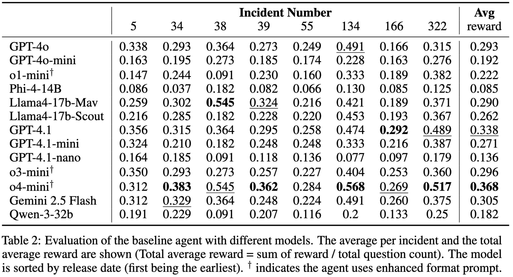

# ExCyTIn-Bench: Evaluating LLM agents on Cyber Threat Investigation

- Arxiv version of the paper will come soon!

We present the first benchmark to test LLM-based agents on threat hunting in the form of security question-answering pairs.

The environment consists 2 main components:
1. A MYSQL database where an agent can interact to retrieve information.
2. A set of generated questions and answers for testing in `secgym/questions/tests` folder.


<!-- display pdf as image -->


## 🛠️ Environment Setup

1. Download database from Hugging Face
    Please download the data from the proivided link: https://huggingface.co/datasets/kevinwyr/excytin_database.
    Put the folder `data_anonymized` under `secgym/database/`.

2. We are using MYSQL docker container for the database. Please first install Docker Desktop and docker-compose and then pull the mysql image:
    ```bash
    docker pull mysql:9.0
    ```

3. Make sure your Docker Desktop is open, then run the following command to set up the mysql container for 8 different databases:
    ```bash
    bash scripts/setup_docker.sh
    ```
    It will run this command: `python secgym/database/setup_database.py --csv <path_to_csv_folder> --port <port> --sql_file <path_to_sql_file> --container_name <container_name> ` for 8 different incidents.

    This script will create 8 different containers. Note that these container are binded to the csv files in the `data_anonymized` folder. This will take up 10GB of disk space.
    Check out volumes with `docker system df -v`.

    To set docker for a database that contains all the data (all 8 attacks), please uncomment the first command in `setup_docker.sh`. Note that this will take up 33GB of disk space.

4. Setup the environment using conda or venv with Python=3.11 and install the requirements with `pip install -e .`.The following is an example using conda:
    ```bash
    conda create -n excytin python=3.11
    conda activate excytin
    pip install -e . -use-pep517
    ```

5. LLM setup
    We are using [AG2](https://docs.ag2.ai/latest/) for API calling. Setup your API key in the `secgym/myconfig.py` file. You can follow the instructions [here](https://autogen-ai.github.io/autogen/docs/notebooks/autogen_uniformed_api_calling#config-list-setup).


## 🏃‍♂️ Runs

1. Run Baseline. `--trial_run` will run only 2 questions from 1 incident for testing purposes. The results will be saved in `experiments/final_results` folder.
    ```bash
    python experiments/run_exp.py --trial_run
    ```

## 🤖 Question Generation Process

All the questions are generated based on constructed graphs from the database.
The generation process is as follows:
1. The `SecurityIncident` and `SecurityAlert` logs are used to construct a graph for each incident, check out this [notebook](notebooks/extract_construct_graph.ipynb) for more details.
2. We run train-test split on the constructed graph. Run the [question_split.ipynb](notebooks/question_split.ipynb) notebook to get the split (saved to `experiements/split_files`). The train and test are split based on a proposed path relavance score.
2. We use LLM to generate questions based on the constructed graph. Currently, we already have the questions generated for the 8 different incidents in the `secgym/questions/tests` folder using OpenAI O1. If you want to rerun the question generation process, please use the following command:

    ```bash
    python experiments/run_qa_gen.py --model gpt-4.1 --solution_model gpt-4.1 --relevant_type low_split --qa_path secgym/qagen/graph_files
    ```
    Note here we use `gpt-4.1` as the model question and solution generation. 


After all the questions are generated, you should expect new files in `secgym/questions` folder like `incident_<i>_qa.json` where `i` is the incident number.


## 📊 Results

Below is the evaluation results of the LLM agents on the test questions. We set temperature = 0 and max_step = 25. GPT-4o is used for evaluation. The full evaluation logs can be downloaded from [this link](https://drive.google.com/file/d/1k6lJ50RUL1c03YL-VF4kLzsLuIvm9sxI/view?usp=sharing).



## 📝 Citation

